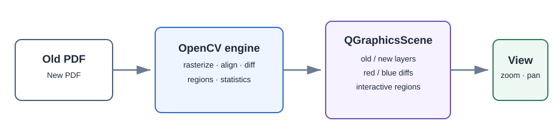

# PDF Differences Viewer

A native desktop application for comparing two PDF drawing revisions. It uses
PyMuPDF, Pillow, and NumPy to rasterize, align, and classify drawing differences,
then uses **PyQt6 `QGraphicsView`** to render the result. There is no Qt WebEngine,
embedded browser, local web server, or browser profile.



## What it does

- Opens an old and a new PDF, with a selectable page in each document.
- Rasterizes and aligns the old drawing to the new one before calculating the
  difference, which reduces false positives caused by small page shifts.
- Displays the old drawing, new drawing, bright-blue additions, and bright-red removals as
  independent `QGraphicsPixmapItem` layers.
- Provides a smooth old-to-new review slider, independent addition/removal
  toggles, Ctrl-wheel zoom, fit/reset controls, and a clickable change list.
- Keeps all image processing local. It does not upload drawings or require an
  API key.

## Run it

Python 3.10+ is required.

```powershell
git clone https://github.com/jxfuller1/PDF_differences_viewer.git
cd PDF_differences_viewer
python -m venv .venv
.\.venv\Scripts\Activate.ps1
pip install -e .
pdf-differences-viewer
```

You can also start it without installing the command:

```powershell
python -m pdf_differences_viewer
```

## Native viewer controls

| Control | Action |
| --- | --- |
| `Ctrl` + mouse wheel | Zoom around the cursor |
| Mouse wheel | Scroll the drawing without changing zoom |
| Click a change | Select it in the change list |
| Double-click a change | Zoom to that change |
| `F` / Fit | Fit the drawing to the viewer |
| `0` / Reset | Return to a 1:1 zoom |

The blend slider starts on the old drawing and ends on the new drawing. Blue
additions and red removals are strongest in the middle, so the endpoints remain
clean for direct revision review.

Change boxes pulse slowly to make them easy to find. To tune the speed, adjust
`ChangeBoxPulseSettings.PERIOD_MS` near the top of
`src/pdf_differences_viewer/graphics.py` (the default is 2,000 milliseconds).
Their translucent interiors use the same blue or red as the corresponding
difference type, and the pointer becomes a hand when it is over a box.

## Development

```powershell
pip install -e ".[dev]"
pytest
```

## Design

The application deliberately uses Qt's scene graph rather than HTML:

```text
PDFs → NumPy/Pillow comparison → QGraphicsScene
                                 ├── old drawing pixmap
                                 ├── new drawing pixmap
                                 ├── bright-blue additions pixmap
                                 ├── bright-red removals pixmap
                                 └── interactive region overlays
```

The `QGraphicsView` approach lets Qt composite the layers directly, preserves
high-quality pixmap rendering at arbitrary zoom levels and makes region
selection native Qt interactions.

OpenCV is not a runtime dependency. The development extra retains it only as
an independent compatibility oracle for the image-processing tests.

## Attribution

This is a native-viewer rewrite inspired by
[DrawingContrast](https://github.com/ayumilove/DrawingContrast), whose MIT
license and attribution are reproduced in [NOTICE.md](NOTICE.md).
